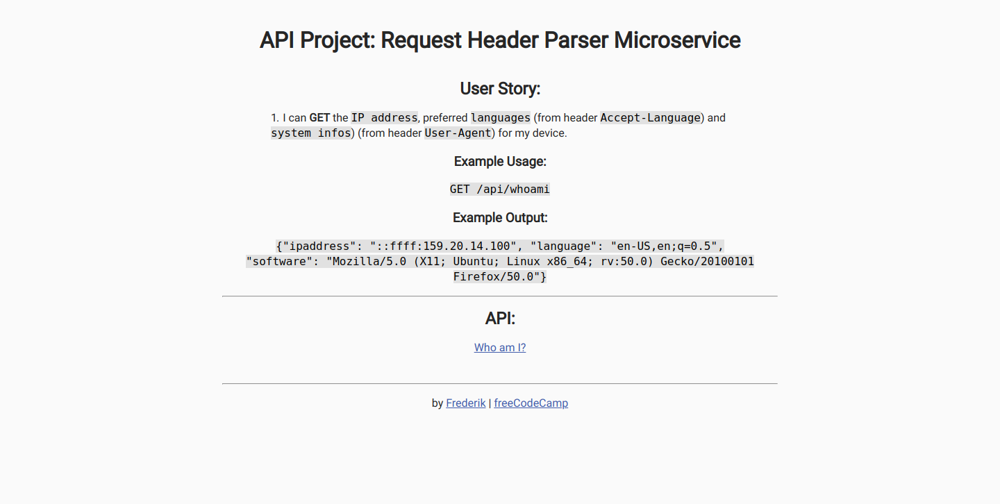

# Request Header Parser

## Introduction
IP address, language and system information are displayed to the user.

This project is part of freeCodeCamps API And Microservices certificate.
***
## Project Requirements
* The IP address, preferred languages (from header `Accept-Language`) and system infos (from header `User-Agent`) of the current device can be retrieved.
***
## Final Project
https://fcc-api-request-header-parser-fred.glitch.me
***
## Behind the scenes
### Backend:
* Node
* Express

### Hosting:
* Glitch
***
## Preview Images
### Main Screen:

